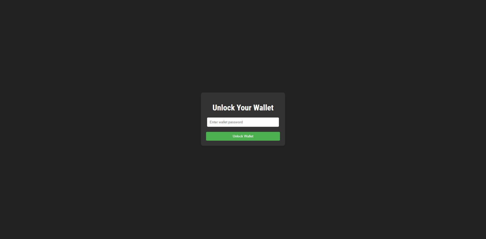

# LND App

This application provides a user-friendly graphical interface for interacting with the Lightning Network Daemon (LND), eliminating the need for command-line operations. It simplifies the process of managing LND functionalities, allowing users to easily perform tasks such as unlocking wallets, opening and closing channels, and handling transactions directly through the interface, thereby making the LND more accessible to non-technical users

## Prerequisites
- Ensure you have `bitcoind` and `lnd` installed on your machine.
- Configure them to run on signet.
- Use port 8080 to expose the Lightning Network Daemon API (default port).
- Place your `tls.cert` inside `.lnd` and your `adminMacaroon` inside `.lnd/data/chain/bitcoin/signet` (default location).

## Getting Started
1. **Initial Setup**: Ensure `bitcoind` and `lnd` are running on your computer. Do not unlock your wallet at this stage.

2. **Unlock Your Wallet**: Unlock your wallet from the application by entering your wallet password. Post this, you'll be redirected to the home page.

   

3. **Dashboard Access**: Click on the menu to access the dashboard section. Here, you can find information about your node, balance, and channels.

   

4. **Channel and Payment Operations**: Open and close channels, create invoices, and send payments.

   - Example of channel opening functionality:

     

     To open a channel (e.g., between Alice and Bob), you need Bob's node public key.

     
     

   - **Note**: This feature demonstration is on regtest. The application, however, runs on signet.

### Switching from Regtest to Signet
- The app reads my TLS certificate and admin.macaroon from my files.
- After entering my password, I could unlock my wallet and access the app.

  

## Common Issues and Solutions

### Problems Encountered
- **Requirement for Another Node**: To open a channel, communication with another node is necessary.
- **Polar Usage**: Polar is intended for Lightning and Bitcoin application development. It requires a rapid feedback loop, making the regtest network more suitable than mainnet or testnet. So Polar forces me to switch on regtest (it doesn't work on signet or mainnet as I read in a FAQ : Can I use it on mainnet or testnet? Unfortunately, Polar was built to improve the experience of developers building applications for Lightning and Bitcoin. Waiting 10 minutes for your channel to open just won't cut it.)

### Resolving Network and API Issues
1. **Network Isolation in Regtest**: Regtest network used by my group of nodes in Polar and my local Regtest are not the same network. Regtest instances are isolated. Blocks mined in one environment are not visible in others.
2. **TLS Certificate Error**: Encountered a 'self-signed certificate' error when interacting with Bob using the LND API.

   Solution: 
   - Set `rejectUnauthorized: false` in axios instance creation.
   - Change the API URL from `https://localhost:8080` to `https://127.0.0.1:8082`, which is Alice's REST host.

   > **Note**: Post-development, switch back to `https://localhost:8080`.

### Invoice and Payment Testing
- Create an invoice using the application. To test payment functionality, use a different account (e.g., create an invoice from Bob's account and pay it from Alice's account).