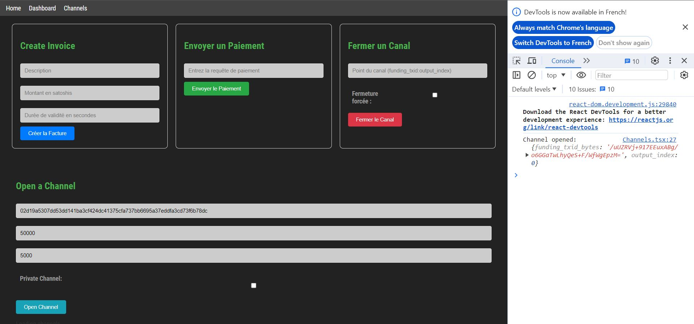

Note : FAIRE UNE LECTURE AUTO DES FICHIERS MACAROON ET TLS.cert du user
SI NON TROUVE DEMANDE A L UTILISATEUR SOIT DE DL LND, SOIT DE DRAG AND DROP CES FICHIERS s'il les a déplacé
faire tout le développement en regtest. Et ensuite une fois le développement fini remplacé le config js par ça :
const fs = require('fs');
const axios = require('axios');
const https = require('https');

const tlsCert = fs.readFileSync('./tls.cert');
const macaroon = fs.readFileSync('./admin.macaroon').toString('hex');   // auth
const apiUrl = 'https://localhost:8080';

// instance axios pour requêtes HTTPS (d'où la nécéssité du certif TLS)
const axiosInstance = axios.create({
  httpsAgent: new https.Agent({
    rejectUnauthorized: false,
    ca: tlsCert,
  }),
});

module.exports = { axiosInstance, macaroon, apiUrl };

## Le site 

Quand vous arrivez sur le site, il faut que bitcoind et lnd tourne sur votre ordinateur, et il faut que vous n'ayez pas encore dévérouillé votre wallet.

La première étape va être de dévérouiller votre wallet. Une fois que vous rentrez votre mot de passe vous serez rediriger sur la page d'accueil.

Ensuite, vous pouvez accéder en cliquant sur le menu à la partie dashboard, où vous pouvez retrouver différentes informations sur votre noeud, votre balance et vos channels.

Enfin vous avez une partie où vous pouvez ouvrir et fermer des channels, ainsi que créer des invoice et envoyer des payements.

Exemple de la fonctionnalité d'ouverture de channel :

A noté que je présente une des fonctionnalités en étant sur regtest, mais qu'à l'heure où vous lisez ceci l'application ne fonctionne pas sur regtest mais signet.

## Problèmes rencontrés

Pour ouvrir un channel il me faut un autre noeud avec lequel communiqué.

C'est pour ca que j'ai voulu utilisé Polar, mais j'ai rencontré un problème, on peut lire dans la FAQ de polar:
`
Can I use it on mainnet or testnet?
Unfortunately, Polar was built to improve the experience of developers building applications for Lightning and Bitcoin. To obtain the immediate feedback loop necessary to be productive, you'll need to be able to mine blocks as fast as possible. Waiting 10 minutes for your channel to open just won't cut it.
`

En gros, je suis obligé d'utilisé le réseau regtest.
Je passe donc mon réseau en regtest mais j'ai compris la chose suivante :
le réseau Regtest utilisé par mon groupe de nœuds dans Polar et mon Regtest local ne sont pas les mêmes réseaux. Chaque instance de Regtest fonctionne de manière isolée, ce qui signifie que les blocs minés dans un environnement Regtest ne seront pas visibles dans un autre et que ces environnements n'interagissent pas entre eux.

Donc je me suis dit que j'allais copié collé non pas mon cert.tls et mon admin.macaroonn, mais celui d'alice. Cependant en voulant interagir avec Bob en passant par l'API LND, j'ai obtenu une erreur :
{
  "message": "self-signed certificate"
}

j'ai rajouté cette ligne dans la création de mon instance axios :
rejectUnauthorized: false,

mais je me suis rendu compte que ma grosse erreur était d'avoir laissé :

const apiUrl = 'https://localhost:8080';

Je l'ai ensuite remplacé par: const apiUrl = 'https://localhost:8080'; qui est l'hôte REST associé à Alice. En effet, si on souhaite utiliser les nœuds LND sur Polar, on doit également faire nos appels API à ces nœuds spécifiques, et non à un nœud LND local. Chaque nœud dans Polar a sa propre API, accessible via un port spécifique attribué par Polar.

## Comment utiliser l'app

- avoir bitcoind et lnd d'installer

- copier dans backend votre certificat tls ainsi que votre macaroon path

Partie invoice et payement. Pour tester la fonctionnalité de créer un invoice, on peut utiliser mon application. mais vous ne pourrez pas payez vous même l'invoice ... Pourquoi ? Parce qu'on ne peut pas payer un invoice pour soit-même. Donc ce que j'ai fait pour teste c'est que j'ai créé un invoice depuis Polar, depuis le compte de Bob, demandant 50000sat à Alice. J'ai copié le payement_request dans mon form pour sendpayment, et j'ai pu envoyé le payement à partir de l'invoice