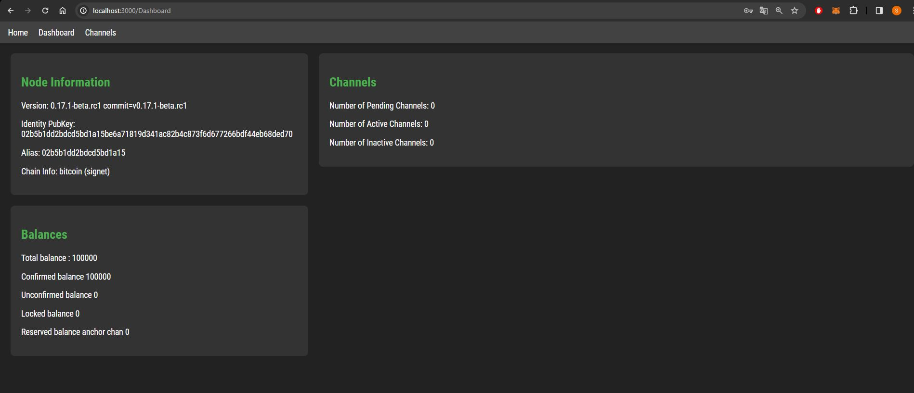

## How to use the site

As a user, you must first have bitcoind and lnd installed on your machine, and have configured them to run on signet.

you must also use port 8080 to expose the Lightning Network Daemon API (this is normally the default port).

When you arrive on the site, bitcoind and lnd must be running on your computer, and you must not have unlocked your wallet for now.

The first step is to unlock your wallet from the application by entering your wallet password. Once you've entered your password, you'll be redirected to the home page.

Then, by clicking on the menu, you can access the dashboard section, where you can find various information about your node, your balance and your channels.

Finally, there's a section where you can open and close channels, as well as create invoices and send payments.

Example of the channel opening functionality:

Note that I'm presenting one of the features on regtest, but at the time you're reading this the application isn't running on regtest but signet.

Switching from regtest to signet :

the app reads my tls certifcat and my admin.macaroon in my files, then I entered my password and was able to unlock my wallet and access the app:

## Problems encountered

To open a channel, I need another node to communicate with.

That's why I wanted to use Polar, but I encountered a problem, you can read in the polar FAQ:
`
Can I use it on mainnet or testnet?
Unfortunately, Polar was built to improve the experience of developers building applications for Lightning and Bitcoin. To obtain the immediate feedback loop necessary to be productive, you'll need to be able to mine blocks as fast as possible. Waiting 10 minutes for your channel to open just won't cut it.
`

Basically, I'm forced to use the regtest network.
So I'm switching my network to regtest, but I've realized the following:
the Regtest network used by my group of nodes in Polar and my local Regtest are not the same network. Each Regtest instance works in isolation, which means that blocks mined in one Regtest environment won't be visible in another, and these environments don't interact with each other.

So I thought I'd copy and paste not my cert.tls and admin.macaroonn, but alice's. However, when I tried to interact with Bob using the LND API, I got an error:
{
  "message": "self-signed certificate"
}

I added this line in the creation of my axios instance:
rejectUnauthorized: false,

but I realized that my big mistake was to have left :

const apiUrl = 'https://localhost:8080';

I then replaced it with: const apiUrl = 'https://127.0.0.1:8082'; which is the REST host associated with Alice. This is because, if we want to use LND nodes on Polar, we also need to make our API calls to these specific nodes, not to a local LND node. Each node in Polar has its own API, accessible via a specific port assigned by Polar.

NB : after the development part, i switch again on https://localhost:8080

Invoice and payment part. To test the functionality of creating an invoice, you can use my application. But you won't be able to pay the invoice yourself... Why not? Because you can't pay an invoice for yourself. So what I did was to create an invoice from Polar, from Bob's account, requesting 50000sat from Alice. I copied the payement_request into my form for sendpayment, and was able to send the payment from the invoice and check that it worked on regtest.